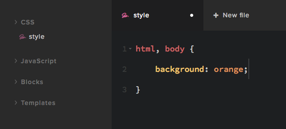

# Level 1 – Get started with CSS

Firecode gives you a single CSS file which allows you to write CSS that will be applied to the website. 
Please note that you can't access existing CSS code, you will have to write rules that override the defaults.
We have a great examples page to show you how to do this.



Go to the `style` file in the code navigation tree. Enter something simple to get started, lets go with this:

```css
.top-menu-wrapper {
    background: #333;	
}

.inline-menu ul li a {
    color: #f3f3f3;
}

.inline-menu ul li a:hover {
    color: #f7db97;
}
```

This will change the navigation bar to a black background with white links and a yellowish hover color.

Save the file (CMD + S is very nice keyboard shortcut). Now your website in another tab and see how it looks.

Congratulations, you've just completed your first code design change with Snowfire! 

## SCSS

Firecode has built in support for the SCSS syntax. This makes is much faster and simpler to write code. A quick example:

```css
.inline-menu ul li a {
    color: #f3f3f3;

    &:hover {
        color: #f7db97;
    }
}
```

This creates the same hover effect, without you having to type the selector multiple times. 

SASS is great thanks to

* Variables
* Nesting
* Partials
* Mixins
* Operators

Read all about SASS at http://sass-lang.com/guide

## Imports

To structure your styles we recommend using partials. Think of your `style` file as the master. And all new CSS files you create as partials.

Create a new CSS file with the name of `top`. In the file tree you'll see `_top`. Open that file and enter the following code

```css
.top-menu-wrapper {
    font-size: 48px;	
}
```

Now head back to your `style` and write:

```css
@import '_top'
```

This will import the top file into the `style`, which then will be included on your website. Imagine the possibilities! 

Create partials for

* `top`
* `footer`
* `blog`
* `block-my-own`

and so much more! 