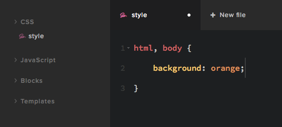

# Level 1 – Get started with CSS

Snowfire Code gives you a single CSS file which allows you to write CSS that will be applied to the website. 
Please note that you can't access existing CSS code, you will have to write rules that override the defaults.
We have a great examples page to show you how to do this.



Go to the `style` file in the code navigation tree. Enter something simple to get started, lets go with this:

```css
.top-menu-wrapper {
    background: #333;	
}

.inline-menu ul li a {
    color: #f3f3f3;
}

.inline-menu ul li a:hover {
    color: #f7db97;
}
```

This will change the navigation bar to a black background with white links and a yellowish hover color.

Save the file (CMD + S is very nice keyboard shortcut). Now your website in another tab and see how it looks.

Congratulations, you've just completed your first code design change with Snowfire! 
