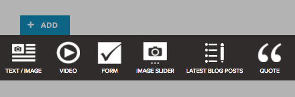
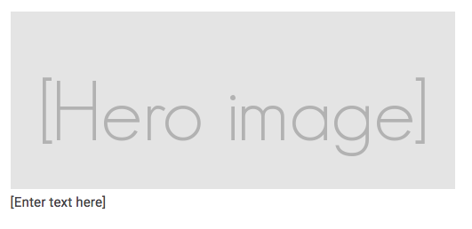
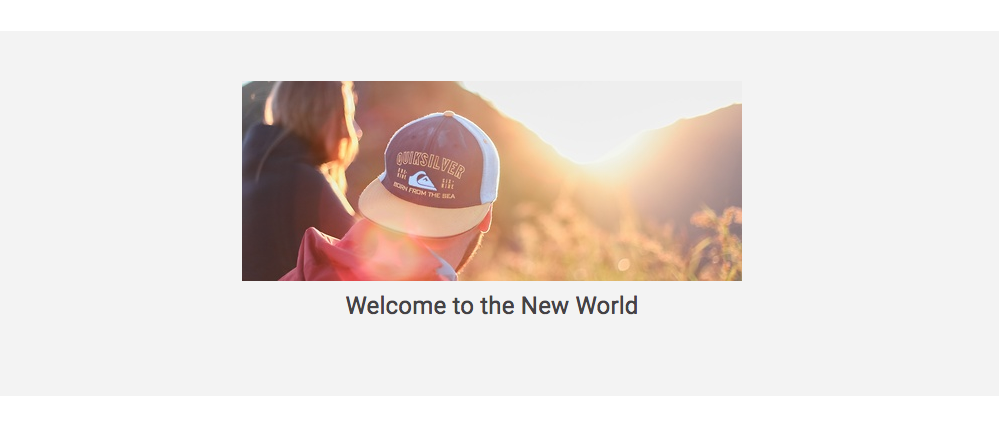

# Create a block

Blocks are the foundation of Snowfire. Think of your page as a blank canvas and blocks is everything you see.

From a user perspective, blocks show up when you hit the `ADD` button



A block is actually just a piece of HTML. Simple as that :) Now lets create one! Create a new file and choose `Block`. 
I'll call my block `pretty-image`. By default you get this code:

```html
<wysiwyg id="{{ component_id_0 }}" description="Enter text here" enable-lists="true"></wysiwyg>
```

This is a Snowfire specific tag which lets the user enter their own content in a text editor. 
See the tags documentation for all different kind of Snowfire tags you can use.

Now lets add an image

```html
<div class="hero">
    <div class="hero-image">
        <!-- Snowfire Tag to allow the user to change image -->
        <image2
            id="{{ component_id_1 }}"
            description="Hero image"
            width="500"
            height="200"
            crop="true"
            resizable="false"
            dimensions="min-max"
        ></image2>
    </div>
    <div class="hero-text">
        <!-- Snowfire Tag to allow the user to change text -->
        <wysiwyg id="{{ component_id_0 }}" description="Enter text here" enable-lists="false"></wysiwyg>
    </div>
</div>
``` 

Create a new blank page within the Snowfire UI and hit `ADD` to insert your new block on the page. 
It should look something like this:



The grey area is a placeholder for the 500x200 image. Text within brackets `[]` is the description. 
To give the user instructions on what to do. Text within brackets are never visible when you publish a page.

## CSS

Lets make this look a bit better by adding CSS. Go to the `style` file in Snowfire Code and write:

```css
.pretty-image {
    .hero {
        text-align: center;
    }
    
    .hero-image {
        margin-bottom: 10px;        
    }
    
    .hero-text {
        p {
            font-size: 24px;
        }
    }
}
``` 


**Congratulations!** You have created your first block. Try to add another `pretty image` block in the user interface and 
put them next to each other. This empowers you to build great blocks for other Snowfire users.

## 100% 

Now, what if we want a block that has a width of 100%? If we continue with this block, add the following CSS

```css
.columns.pretty-image {
    max-width: 100%;
    padding-left: 0;
    padding-right: 0;
    
    background: #f3f3f3;
}
```

This will make the block become 100% and add a background color. To add padding, please create a wrapper div.
Which is what I've done with the `<div class="hero">` in this example.

Style it like this: 

```css
.pretty-image .hero {
    text-align: center;
    padding: 50px 0;
    max-width: 1170px;
    margin: 0 auto;
}
```

This will add padding, and set the max-width for its content to `1170` which is the default content width for blocks.


