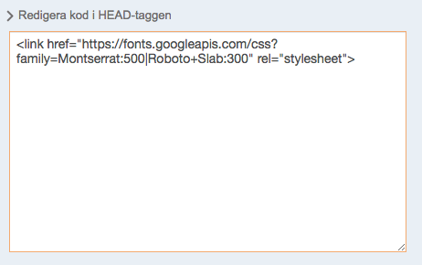

# Use a custom font from Google

Select your font from [fonts.google.com](http://fonts.google.com). Copy the embed code which looks like this (we're using Montserrat and Roboto Slab in our examples):

```html
<link href="https://fonts.googleapis.com/css?family=Montserrat:500|Roboto+Slab:300" rel="stylesheet">
```

In Snowfire, go to menu -> settings -> add code in head/body. Edit page in the head tag:



Then open Firecode (in your dev menu). In the CSS file override the current font with this:

```css
// Change heading font
h1, .text h1 > a, h2, .text h2 > a, h3, .text h3 > a, h4, .act-as-h1, .intro .title, .product .name, .sf-product .name {
    font-family: 'Montserrat', sans-serif;
}

// Change paragraph font
.act_as_snippet_area_main p, p, ol, ul, label, .label-style, .snippet_area_main, .act_as_snippet_area_main, .menu a, .sf-button, .sf-btn, input[type='submit'], .text a, .product-collection article .price, .product .price, .sf-link {
    font-family: 'Roboto Slab', serif;
}
```

